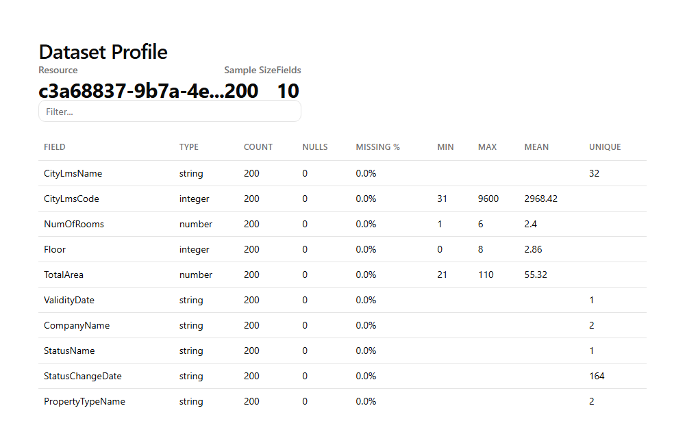
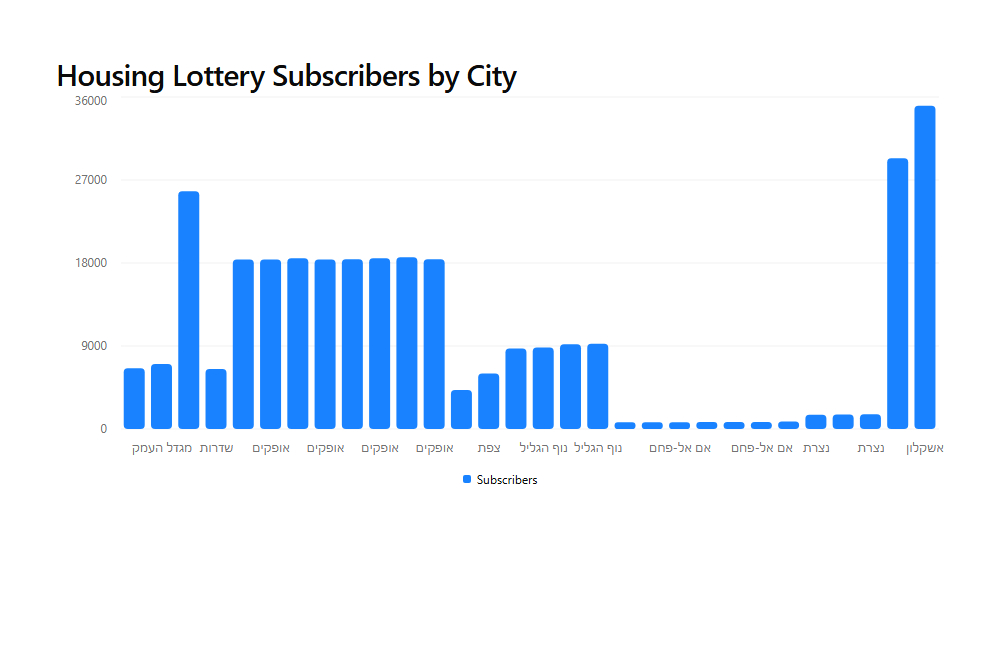
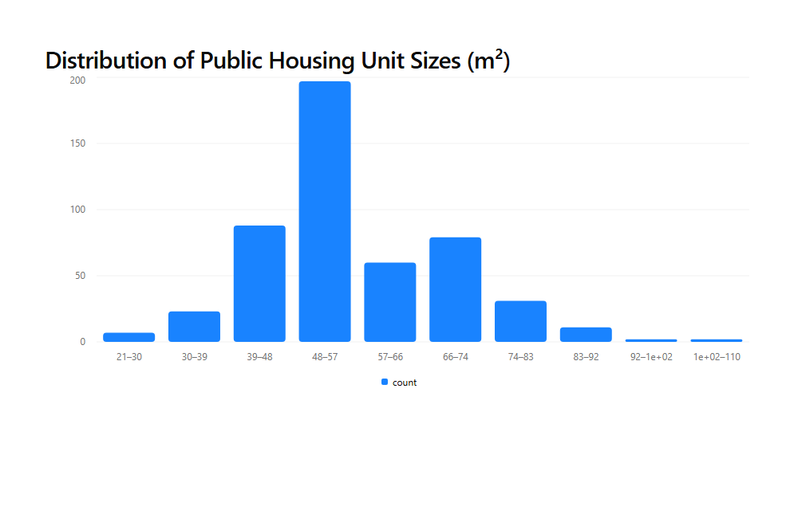
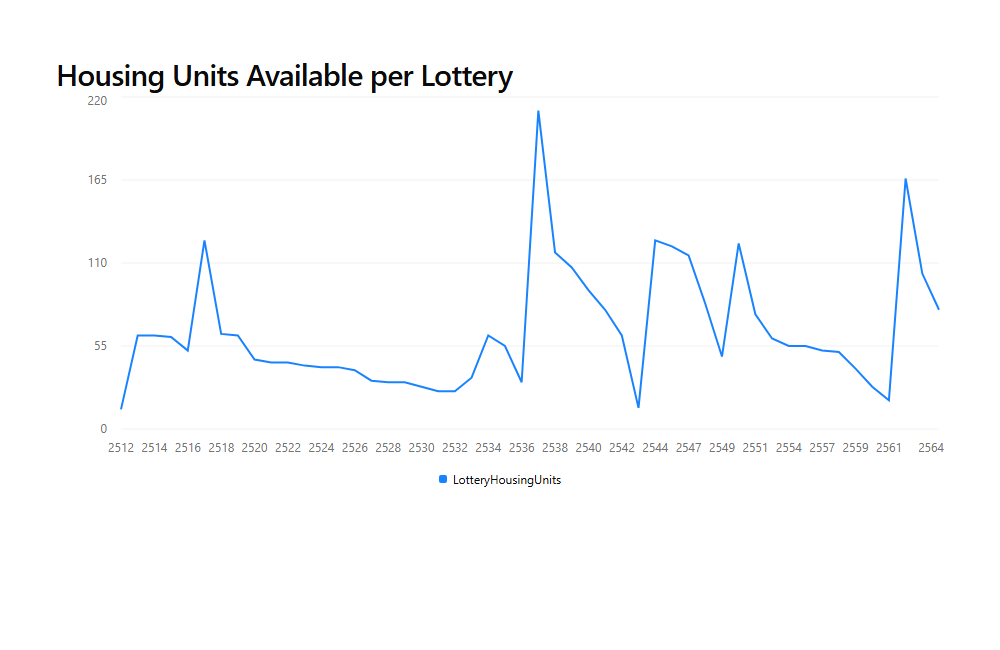
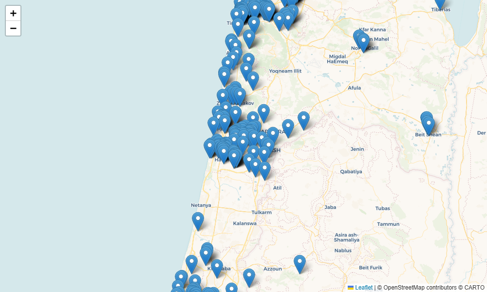
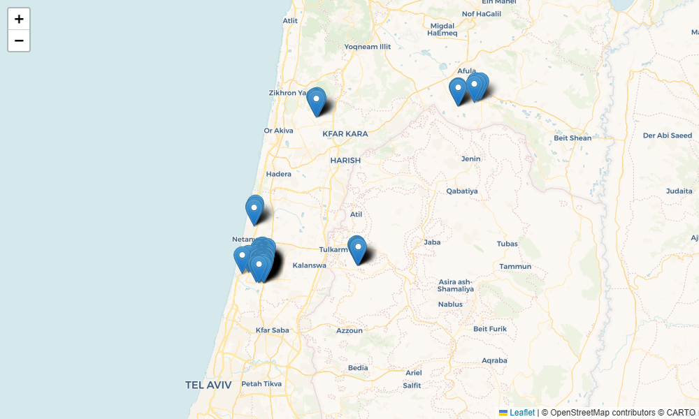

# DataGov Israel MCP Server

An MCP server for exploring Israeli government open data ([data.gov.il](https://data.gov.il)) — with built-in interactive visualizations powered by [MCP Apps](https://gofastmcp.com).

Search thousands of public datasets, profile their structure, generate charts, and plot geographic data on maps — all from your AI assistant.

[](https://github.com/aviveldan/datagov-mcp/actions/workflows/test.yml)
[](https://www.python.org/downloads/)
[](https://opensource.org/licenses/MIT)

---

## What Can You Do With This?

### 🏠 Explore the Housing Market

Profile public housing datasets to understand unit sizes, locations, and availability:



See which cities have the most demand in government housing lotteries:



Understand the distribution of apartment sizes across the country:



Track housing unit availability over time:



### 🗺️ Map Public Infrastructure

Visualize education institutions across Israel:



Plot public transport stations:



---

## Quick Start

### Installation

```bash
git clone https://github.com/aviveldan/datagov-mcp.git
cd datagov-mcp

# Create virtual environment and install (requires uv)
uv venv
source .venv/bin/activate  # On Windows: .venv\Scripts\activate
uv pip install -e ".[dev]"
```

### Using with Claude Desktop

```bash
fastmcp install claude-desktop server.py
```

Restart Claude Desktop — you'll see the DataGovIL tools available immediately.

### Try It with the MCP Inspector

```bash
fastmcp dev inspector server.py
```

This opens a web UI where you can browse tools, test them interactively, and preview MCP App visualizations in the **Apps** tab.

### Using with `fastmcp dev apps`

Preview the interactive visualization apps locally:

```bash
fastmcp dev apps server.py
```

---

## Example: Finding Real Estate Opportunities

Here's a real workflow for someone exploring the Israeli housing market:

```
You: "Search for discounted housing lottery datasets"

→ package_search(q="דירה בהנחה")
  Found: "נתונים תקופתיים - תכנית דירה בהנחה" (Discounted Housing Program)
  Resource ID: 7c8255d0-49ef-49db-8904-4cf917586031

You: "Profile this dataset so I can understand what fields are available"

→ dataset_profile(resource_id="7c8255d0-49ef-49db-8904-4cf917586031")
  Shows: LamasName (city), Subscribers, Winners, PriceForMeter,
         LotteryHousingUnits, ProjectName, Neighborhood...

You: "Show me which cities have the most subscribers competing for units"

→ chart_generator(
    resource_id="7c8255d0-49ef-49db-8904-4cf917586031",
    chart_type="bar",
    x_field="LamasName",
    y_field="Subscribers",
    title="Housing Lottery Subscribers by City"
  )
  → Interactive bar chart rendered in MCP Apps UI

You: "Now show the public housing units — map them and show me sizes"

→ dataset_profile(resource_id="c3a68837-9b7a-4ee7-bd92-130678dc8ae3")
  Shows: CityLmsName, NumOfRooms (avg 2.4), Floor, TotalArea (21-110 m²)...

→ chart_generator(
    resource_id="c3a68837-9b7a-4ee7-bd92-130678dc8ae3",
    chart_type="histogram",
    x_field="TotalArea",
    title="Distribution of Housing Unit Sizes (m²)"
  )
  → Most units are 48-57 m², with a long tail up to 110 m²
```

**Insight:** Cities like Ashkelon and Sderot show 25,000-35,000 subscribers per lottery — that's intense competition. Smaller cities in the periphery (Umm al-Fahm, Nazareth) have far fewer. If you're flexible on location, your odds improve dramatically.

---

## Available Tools

### Core Data Tools

| Tool | Description |
|------|-------------|
| `status_show` | Get CKAN version and site info |
| `license_list` | List available dataset licenses |
| `package_list` | Get all dataset IDs |
| `package_search` | Search datasets with filters and sorting |
| `package_show` | Get detailed metadata for a specific dataset |
| `organization_list` | List all organizations |
| `organization_show` | Get details of a specific organization |
| `resource_search` | Search for resources within datasets |
| `datastore_search` | Query data within a specific resource |
| `fetch_data` | Convenience tool — find dataset by name and fetch its data |

### Visualization Tools (MCP Apps) 📊

These tools render interactive UI directly in MCP-compatible clients.

#### `dataset_profile`

Profile a dataset to understand its structure and quality.

- **Fields detected**: integer, number, string, coordinate
- **Statistics**: min, max, mean, null count, unique values
- **Output**: Interactive DataTable with search/filter

```
dataset_profile(resource_id="c3a68837-9b7a-4ee7-bd92-130678dc8ae3", sample_size=200)
```

#### `chart_generator`

Generate interactive charts from any dataset.

| Chart Type | Use Case |
|------------|----------|
| `histogram` | Distribution of numeric values (e.g., apartment sizes) |
| `bar` | Compare categories (e.g., subscribers per city) |
| `line` | Trends over time (e.g., housing units per lottery) |
| `scatter` | Correlations between two numeric fields |

```
chart_generator(
  resource_id="7c8255d0-49ef-49db-8904-4cf917586031",
  chart_type="bar",
  x_field="LamasName",
  y_field="Subscribers",
  title="Housing Lottery Subscribers by City",
  limit=50
)
```

#### `map_generator`

Plot geographic data on interactive Leaflet maps.

```
map_generator(
  resource_id="e873e6a2-66c1-494f-a677-f5e77348edb0",
  lat_field="Lat",
  lon_field="Long",
  limit=500
)
```

---

## Useful Resource IDs

Here are some interesting datasets to get started with:

| Dataset | Resource ID | Good For |
|---------|-------------|----------|
| ✈️ Flights (טיסות) | `e83f763b-b7d7-479e-b172-ae981ddc6de5` | Bar charts by airline |
| 🏠 Public Housing (דיור ציבורי) | `c3a68837-9b7a-4ee7-bd92-130678dc8ae3` | Histograms, profiling |
| 🎰 Housing Lotteries (דירה בהנחה) | `7c8255d0-49ef-49db-8904-4cf917586031` | Bar/line charts |
| 🚌 Transport Stations (תחנות) | `e873e6a2-66c1-494f-a677-f5e77348edb0` | Maps (has Lat/Long) |
| 🏫 Schools (מוסדות חינוך) | `5c5d6bb0-755d-470d-84b6-d7dd3135ba9c` | Maps (UTM_X/UTM_Y) |

---

## Architecture

### MCP Apps

Visualization tools use [FastMCPApp](https://gofastmcp.com) providers with [prefab-ui](https://github.com/PrefectHQ/prefab-ui) components:

- **`DataProfile` app** → `DataTable`, `Metric` components
- **`Charts` app** → `BarChart`, `LineChart`, `ScatterChart`, `Histogram`
- **`Maps` app** → `Embed` with Leaflet HTML

Tools registered via `@app.ui()` automatically get proper MCP Apps metadata and render in compatible clients.

### Async HTTP Layer

All API calls use `httpx.AsyncClient` with:
- 30-second timeout
- Automatic retries for 5xx errors
- Connection pooling

### Data Safety

- Numeric values from CKAN are coerced (handles `"25"` → `25.0`)
- Map popup content is HTML-escaped to prevent XSS
- Line charts are sorted by x-axis for correct rendering

---

## Development

### Running Tests

```bash
pytest tests/ -v          # 39 tests
pytest tests/ --cov=datagov_mcp  # With coverage
```

### Code Style

```bash
ruff check .   # Lint
ruff format .  # Format
```

### Project Structure

```
datagov-mcp/
├── datagov_mcp/
│   ├── server.py          # Core CKAN tools + provider registration
│   ├── apps.py            # FastMCPApp definitions (DataProfile, Charts, Maps)
│   ├── visualization.py   # Visualization tools (@app.ui entry points)
│   ├── api.py             # CKAN API helper
│   └── client.py          # HTTP client
├── tests/                 # 39 tests with HTTP mocking
│   ├── test_api.py
│   ├── test_contracts.py
│   ├── test_tools.py
│   └── test_visualization.py
├── screenshots/           # Auto-generated demo screenshots
├── server.py              # Entrypoint
└── pyproject.toml
```

---

## Contributing

We welcome contributions! See [CONTRIBUTING.md](CONTRIBUTING.md) for guidelines.

1. Fork the repository
2. Create a feature branch
3. Make changes with tests
4. Submit a pull request

---

## Troubleshooting

### Port Conflicts with MCP Inspector

```bash
pip install nano-dev-utils
python -c "from nano_dev_utils import release_ports; release_ports.PortsRelease().release_all()"
```

### Windows + OneDrive

Avoid running installation in OneDrive-synced folders. See [uv#7906](https://github.com/astral-sh/uv/issues/7906).

### Import Errors

```bash
uv pip install -e ".[dev]"
```

---

## License

MIT — see [LICENSE](./LICENSE).

## Acknowledgments

- Built with [FastMCP](https://gofastmcp.com) and [prefab-ui](https://github.com/PrefectHQ/prefab-ui)
- Data from [Israel Open Data Portal](https://data.gov.il)
- Maps powered by [Leaflet](https://leafletjs.com/) + [CARTO](https://carto.com/)
- Charts powered by [Recharts](https://recharts.org/) (via prefab-ui)
